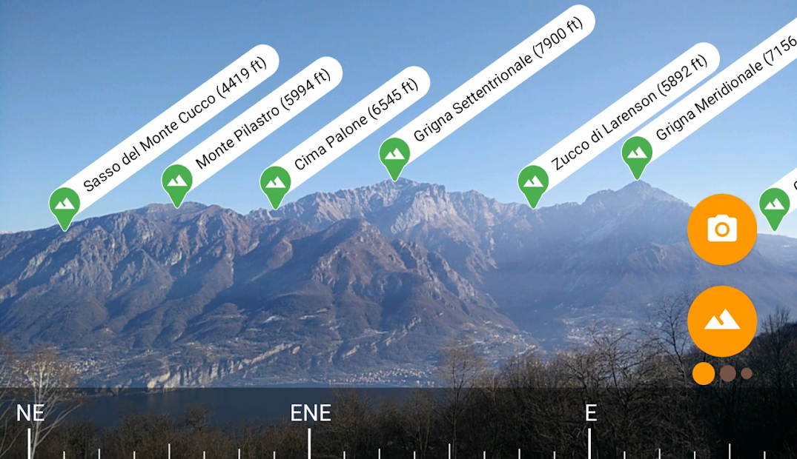

# CS-306 Software Development Project 
___
## Badges

## Application idea 
See [pitch](doc/proposal_template.md) 
### Description
We are planning to build an AR (Augmented Reality) app. Using this app the user could get additional information about the surrounding mountains using 
its smartphone camera. The info such as the peak name, its height and the distance between the user and the mountain would be displayed on the camera preview. 
The app would also implement some user accounts to create a ranking between users. This ranking would be based on the peaks the user scans (more points for higher peaks or "rare" peaks for instance).  

The following image gives an idea of the camera preview with AR that we are aiming to develop 

### Requirements matching
Requirements matching can be found [here](https://docs.google.com/document/d/1GIaJl7t7NFq37tfpWnVez5sFSn7-VLYQSlFwRYH5aeo/edit)
- Language used : Java

___
## Useful links
[Software Development Project Moodle](https://moodle.epfl.ch/course/view.php?id=16172)

[Software Development Piazza](https://piazza.com/class/klgt5iozma44iy#)

[Java Documentation](https://docs.oracle.com/en/java/)

[Android Studio Documentation](https://developer.android.com/docs)

___
## Devs
- Gangloff Maximilian
- Gabriel Bastien 
- Monea Giovanni
- Olsson Alexander
- Srinivasan Ravi
